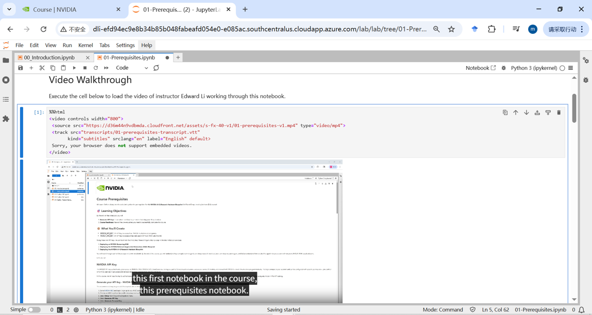
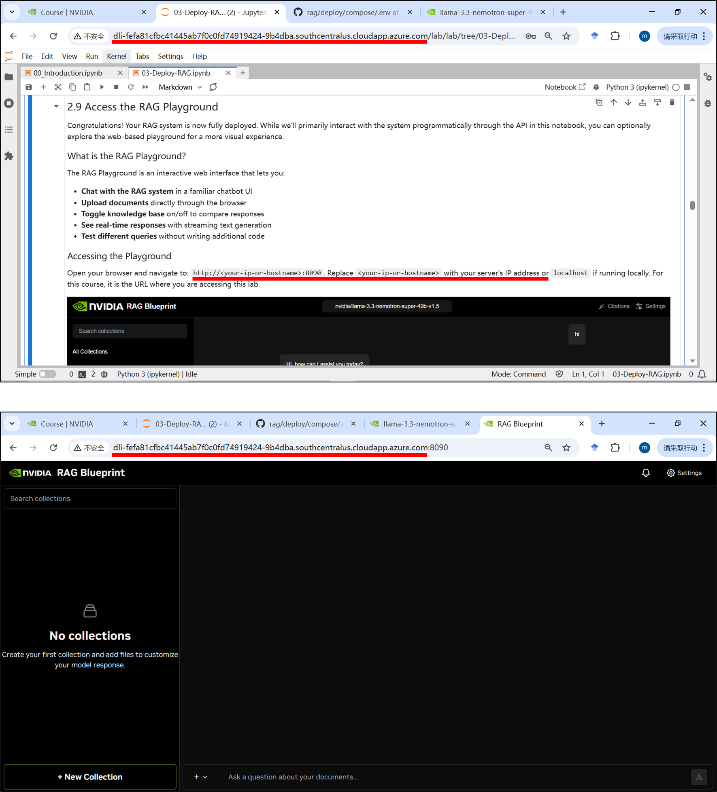
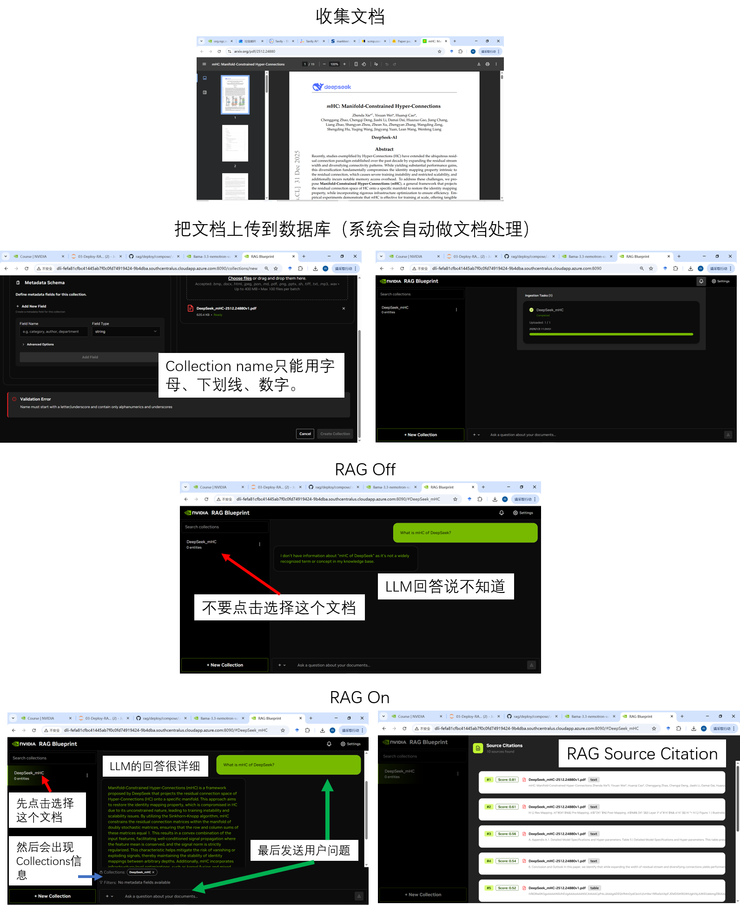
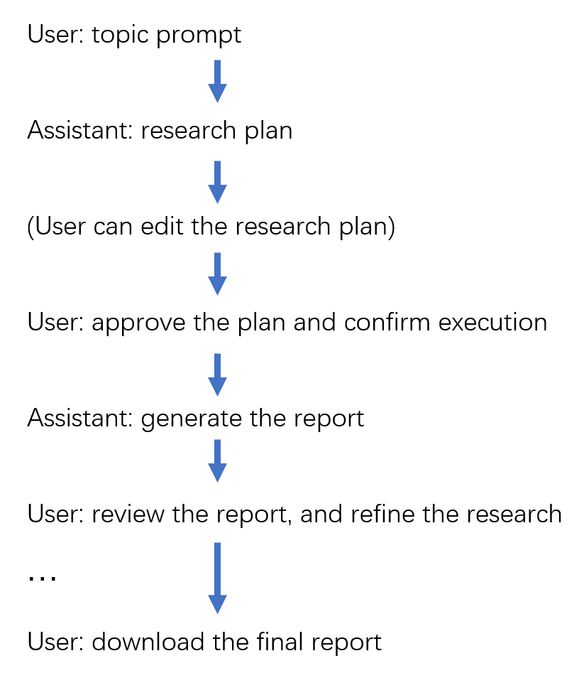
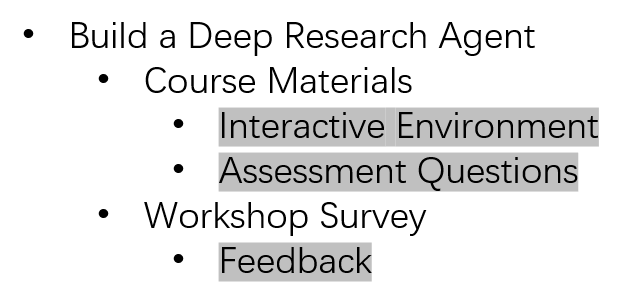
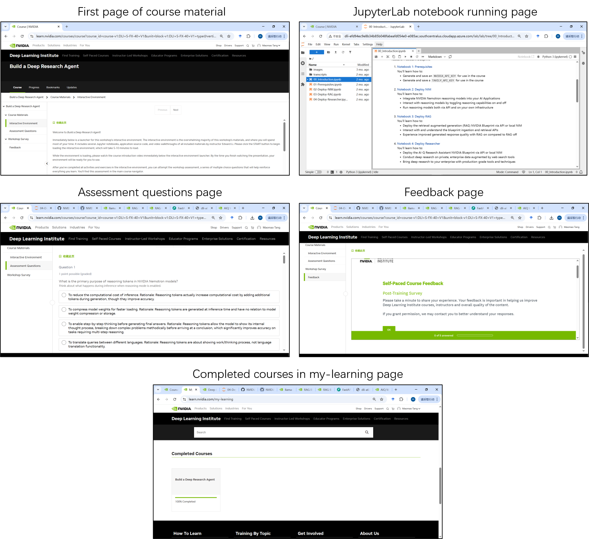

# 浅学深度研究报告Agent--NVIDIA Deep Research Agent学习笔记

Mansen

2026-01-06

## 本文目的

记录我对NVIDIA  Build a Deep Research Agent课程的学习经历，以帮助感兴趣的读者能顺利学完这门课程，特别是能“无痛”地跑通代码实验；再者，浅谈一下我的个人学习感想。

## 本文大纲

本文目的

Build a Deep Research Agent课程（最终）想要教会我们什么？

BDRA课程的简介

如何顺利学完BDRA课程（跑通代码实验）？

个人学习感想

其它

写在后面

## Build a Deep Research Agent课程（最终）想要教会我们什么？

Build a Deep Research Agent这门课程（简称BDRA），想要教会我们搭建、部署、运行一个可以做深度研究的AI 助手。这个AI助手的最终输出形态，是一种研究性报告文章。比如，我想做金融经济方面的研究，并生成一份研究报告。我只需要告诉这个AI助手一个具体的话题，例如“Amazon's 2023 Financial Performance Analysis”(亚马逊公司 2023 年财务业绩分析)，然后它就会去把大的任务拆解为一些列小的任务，查找相关的资料，生成研究报告的各个章节，并进行反思和检查，还可以允许作为人类的我在工作流程中做一些指导和约束，最终生成一份有深度的、高质量的研究报告文章（见图01）。

图01. Deep Research Agent 效果图

为了完成这个教学目标，BDRA课程会教我们一系列的前期基础知识和代码方法，让学员逐步地学习掌握搭建Deep Research Agent所需的知识技能。

## BDRA课程的简介

Build a Deep Research Agent课程，是NVIDIA(英伟达公司) Deep Learning Institute(DLI)中的一门免费线上课程（内容为英文）。报名注册的网址如下（截图见图02）， https://learn.nvidia.com/courses/course-detail?course_id=course-v1:DLI+S-FX-40+V1

提示：我有一个朋友，用了KX上网法，才能看到课程报名注册网页中的"Enroll Now"点击按钮。

图02. 课程报名注册及标题信息网页

在这个网页中，往下观察，能看到课程大纲信息（见图03）。

图03. 课程大纲信息

事实上，正式进入学习界面后，里面含有的学习材料内容是比较多的。有兴趣的读者可以看下文中的“关于这门课程的学习材料组织方式”章节。

简而言之，这门课程主要通过4个可在线运行的JupyterLab notebooks，教会学员，做前期准备工作（拿到可调用NVIDIA云端大模型推理的 NGC API key, 可进行Web搜索的Tavily API key），部署有详细推理能力的NIM容器服务，部署可检索私有文档的RAG Pipeline，以及部署能生成深度研究报告文章的Agent。

## 如何顺利学完BDRA课程（跑通代码实验）？

本章节以课程中的4个主要notebook为线索，讲解顺利跑通这些代码实验的要点。

### 01-Prerequisites.ipynb

首先，如果在访问某些网页时，页面渲染不出来，或者是某些按钮缺失，可以尝试像我的一位朋友那样KX上网。然后，尽量看一下每个notebook里面开头的视频概述，这可以让学员有总览全局的初步印象（见图04）。

图04. Notebook开头的视频概述

还有，我想提一下"NGC"，它表示NVIDIA GPU Cloud services。 进入[https://catalog.ngc.nvidia.com](https://catalog.ngc.nvidia.com/)[/](https://catalog.ngc.nvidia.com/) 这个网站后，你就可以尝试做调用NVIDIA云端大模型的相关工作了。

对于01notebook，我们只要拿到如下这样的2个API key，就完成任务了。

表01. API Keys

| API Key Types | Functions    | Key Content Examples （Fake）                                            |
| ------------- | ------------ | ---------------------------------------------------------------------- |
| NVIDIA NGC    | Calling LLMs | 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 |
| Tavily        | Web search   | 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                              |

### 02-Deploy-NIM.ipynb

首先，NIM是什么？它表示NVIDIA Inference Microservices。即NVIDIA的一些微服务容器，部署运行这些微服务容器，我们就能更便捷地实现对LLMs的推理(inference)调用。而NVIDIA Nemotron 是指一系列的大模型，它们衍生于开源大模型（比如Llama），但是经过了NVIDIA的优化，可专门用于高效理性分析(reasoning)任务和agentic workflows。

Reasoning tokens，则是02notebook中需要重点掌握的知识点。可以这样理解，在对Nemotron模型（比如llama-3_3-nemotron-super-49b-v1_5）做inference调用时，可以接收reasoning参数，如果reasoning参数为True，那么模型会先生成理性分析过程的文字内容(这些文字内容对应的就是reasoning tokens)，而后生成回答正文；如果reasoning参数为False，那么模型则生成回答正文，而不会生成理性分析过程的文字内容。而实际上，在代码中，是通过控制传入system对应的content值("/no_think", "/think")来决定是否生成reasoning tokens。图05中用“strawbarry这个英文单词中有多少个字母r”的问题应答例子，展示了reasoning tokens的效果。

图05. Nemotron LLM inference without or with generating reasoning tokens

02notebook的代码实验还算比较轻松的，但是接下来03、04notebook就要小心了。不妨在运行完02notebook之后，停下来好好休息一下。下次再重新启动整个课程的JupyterLab notebook环境（重新计时，你将又获得4小时的在线运行时间），接着进行03notebook的学习。

### 03-Deploy-RAG.ipynb

尽管这个章节是讲03notebook的，但是我想预先提醒你。如果你运行完03notebook后，重启整个JupyterLab环境（重新计时），然后单独运行后面的04notebook，那么是会出问题的。也就是说，04notebook的运行，是依赖于03notebook的运行结果的。比较好的策略是，03notebook先仔细学一遍，几乎用满4个小时的在线运行时间，然后去休息。下次再重启整个JupyterLab环境，快速地把03notebook运行一遍，接着去运行04notebook(不要关闭03notebook)。

现在回到03notebook的正题。RAG(Retrieval-Augmented Generation)，简单来说，是指把用户提出的问题query放到私有文档数据库里面做搜索，找出最相关的文档片段，然后把刚才的query和这些文档片段一起喂给大模型，从而产生可能是最相关、最确切的回答。

实际上，RAG的组件和工作流程还挺复杂的，原谅我盗用课程材料中一张复杂的图来表示它的复杂（见图06）。

图06. NVIDIA RAG Blueprint

不过在03notebook里，也许注重的是让学员获得部署RAG pipeline的实操体验--能把整个03notebook跑通，就可以了。

关于RAG playground的网址。

在03notebook的2.9 Access the RAG Playground章节中，引导学员去用浏览器访问RAG Blueprint Palyground的Web界面，以体验RAG的效果。该访问网址是学员当前打开的notebook地址的hostname（见图07），然后拼接上端口号":8090"字段信息。

图07. RAG Playground 访问网址及界面

关于LLM without RAG and with RAG的比较。

恰巧DeepSeek在2025年12月31日，刚发表了新论文作为2026新年贺岁大作，我正好可以拿来做这个实验，检验RAG是否能让LLM增强回答关于最近信息问题的能力。

图08. 关于LLM without RAG and with RAG的比较实验

在03notebook中，最好是手动逐个运行代码块单元格cell。因为有些代码涉及docker image文件拉取、启动运行，需要一定的时间，而有些代码写成了async异步函数的形式。如果当容器服务还没运行稳定，或者异步函数的实际工作还没完成，就开始运行后面的单元格的代码块，这就很可能会出问题。特别是notebook中写了，要等待一段时间，再接着运行后面的单元格的地方，要格外注意这个问题。

### 04-Deploy-Researcher.ipynb

04notebook是课程中的最后一个notebook。简单来说，04notebook中的Deep Research Agent的主要目的是生成高质量、可靠性强的研究报告（见图01）。这个Agent在03notebook的RAG pipeline的基础之上，增加了Web search功能作为context上下文信息补充；此外在Agent产品的工作模式上，引入了更多的人类干预节点和措施，从而使得最终生成的研究报告更符合人类用户个体的期望。再次提醒：在成功运行完03notebook后，紧接着去运行04notebook，才能顺利跑通代码实验。

Deep Research Agent背后的系统运行机制如下（见图09）。

图09. Machenism of Deep Research Agent

实际部署时，相比于03notebook中RAG pipeline的8个容器，04notebook中增加了aira-backend, aira-frontend这两个容器，即总共要运行10个容器微服务（见图10）。

图10. 10 Container Services for Deep Research Agent

最终Deep Research Agent App的工作模式如下（见图11）。

图11. Work Mode of the Deep Research Agent App

关于金融经济领域研究的Deep Research Agent App运行实例如下（见图12）。

图12. A Financial Reprot Generated by Deep Research Agent

## 个人学习感想

### RAG pipeline中的re-ranking方法

在03notebook的5. Understanding Document Retrieval and Reranking章节中，详细介绍了在RAG的Retrieval检索过程中的2个阶段（见图13）。

图13. Two Phases in RAG Retrieval

我想重点讲一下，这里的re-ranking，是用一个单独的model去做re-rank，而不是直接根据之前的sementic similarity score去做排序。我的实验结果中，Stage2的位次结果相比于Stage1的位次结果，#2和#3的chunk交换了排序位置，确实发生了重排序。这样做的好处是，不仅仅只是根据语义相似度，去做模糊笼统chunk的排序，而是用更能理解自然语言的模型去做类似人工的甄选排序，如此重排后的位次往往是更符合人类预期的。不过，弊端是引入了模型处理步骤，会增加整个Agent系统的处理时间，增加计算量和资金成本。

### Deep Research Agent的特点

Break-down 拆解，可以说是Deep Research Agent的深度之所在。给它一个研究话题，Agent就能从中拆解出多个任务（见图05，图12），然后分别去获得相应的任务结果，最后把这些结果综合汇总到一起。这种思路与“第1性原理”、分治、穷举都有很大的联系。

无人干预的自动化VS人类介入的人机交互协作。基本上，Deep Research Agent是倾向于需要人类介入的人机交互协作模式的。这样的适用场景是，做深度调研等复杂任务时，能尽量去迎合当前用户的个性化需求。当然如果你一直点击“同意/批准/执行”，也可以看作近似于无人干预的自动化模式。再看其它的一些Agent产品，比如ByteDance字节跳动公司推出的AnyGen App，也是在往人机交互协作co-work的方向上发展。可见对于企业级交付使用的Agent应用，人类用户的明确精准把控是一个很重要的需求。

### Deep Research Agent现阶段还做不到完全符合人类个体预期

我在04notebook的，关于金融经济领域研究的Deep Research Agent App实验中（见图12），当Agent生成了第1版的draft report后，我尝试输入提示词"List outlines in the front part of the report"，让Agent添加report的大纲。而后，Agent生成新版本的report中确实增加了”Report Outline“章节。但是当我仔细去核对它的内容与下文各章节的标题是否一致时，发现很难一眼看出它们之间存在明显的对应关系，仿佛出现了hallucination幻觉。这里可能就需要我再次与Agent发生对话，详细地描述我的需求，才能更好地达到我预期的效果。另外，我认为，关于这个Deep Research Agent系统背后的模型，还需要对它做更多的Post-training和Test improvement，以更智能地领悟一些常见的研究需求。

## 其它

### 关于这门课程的学习材料组织方式

Build a Deep Research Agent课程的高层框架如下（见图14）。

图14. Course framework

学员的主要学习活动在Interactive Environment中进行，课程的首页会自动进入这个环节。学员会看到一段课程概述文字(见图15)，然后是一个课程概述视频，接着需要学员启动JupyterLab notebook 运行环境。等待约15分钟后，就能进入JupyterLab的页面(见图15)。在左侧的目录文件视图区可以看到，有00-04共5个notebooks，每一个notebook里面的开头部分都会有一个该notebook的概述视频，而后就是正式的学习、实验内容。当学员学完这些notebook中的知识，并成功跑通实验代码后，可以去到"Assessment questions"环节(见图15)，做理论习题，然后可以去到"Feedback"环节填写对此课程的反馈信息(见图15)。完成上述所有操作后，可以在"my-learning"页面，看到该课程名称出现在"Completed Courses"的板块中(见图15)。至此，可以完结撒花了！

图15. 不同阶段的课程材料页面

## 写在后面

好吧，终于写到最后一个章节了！我从1月1日元旦开始学习Build a Deep Research Agent这门课程，同时记录学习过程，然后写学习笔记文章，一直忙到了1月6日。元旦假期3天，放了好像没放似的。甚至我还得再搭3天进去，为了写这篇学习笔记文章。

其实这门课程，总体来说已经算是对小白挺友好的了。但是，对于学员的要求，还是需要有一些入门基础的。我感觉最好的适用对象，就是我这种水平的人了。那么，我是什么样的水平呢？我就是在NVIDIA英伟达2025年度黑客松Agent大赛（中国）勇夺"优胜奖"的人！当时对NVIDIA的Agent是一点都没接触过，就是通过那次黑客松比赛，对Agent的应用部署有了上手体验，然后逐渐学习了很多关于Agent的知识。这次学习Build a Deep Research Agent，算是上次Agent大赛延伸出来的一个专题篇--聚焦于如何应用Agent生成高质量的研究报告。通过这次"迷你黑客松"式的浅学，又一次加深了我关于Agent的学习。希望2026年在NVIDIA社区中我们能共同进步吧！
