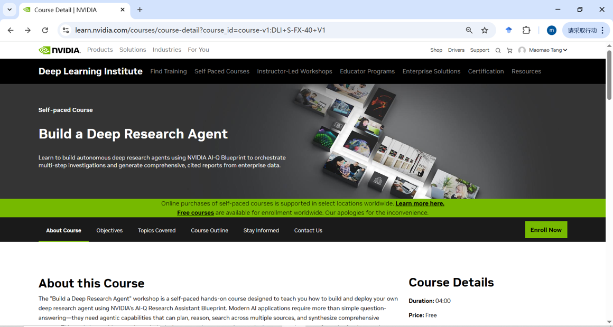
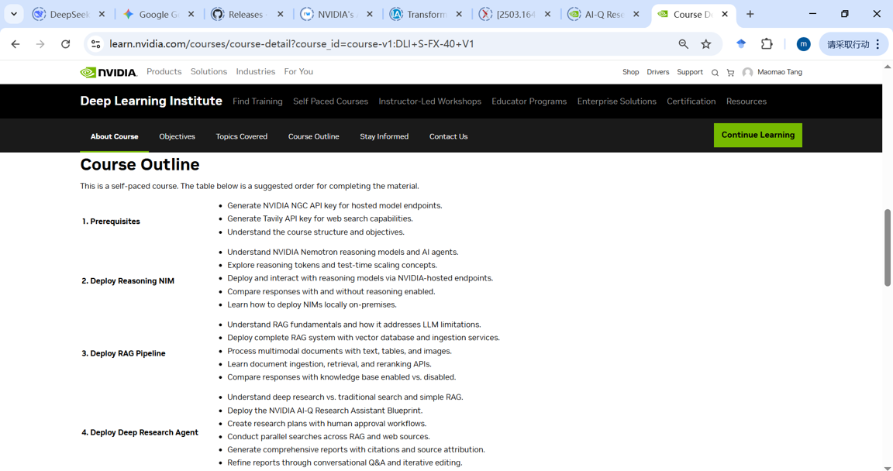
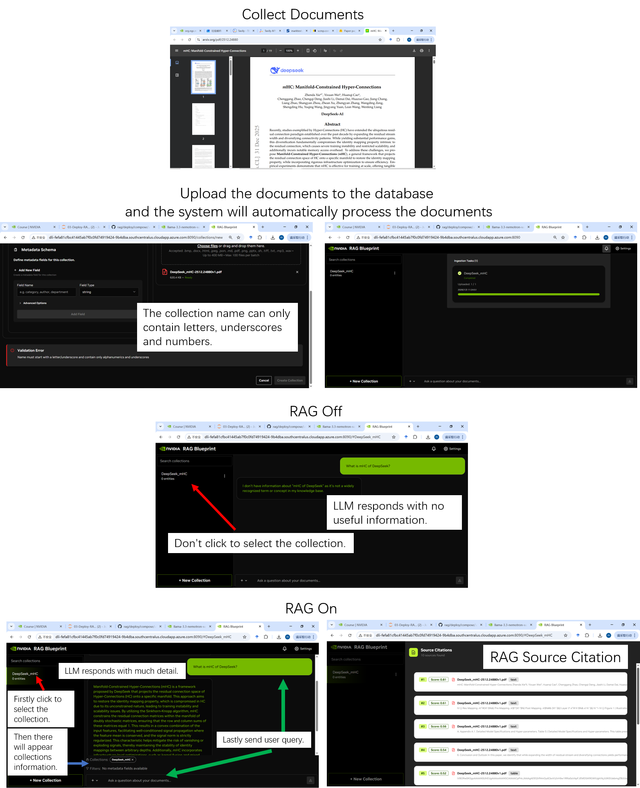
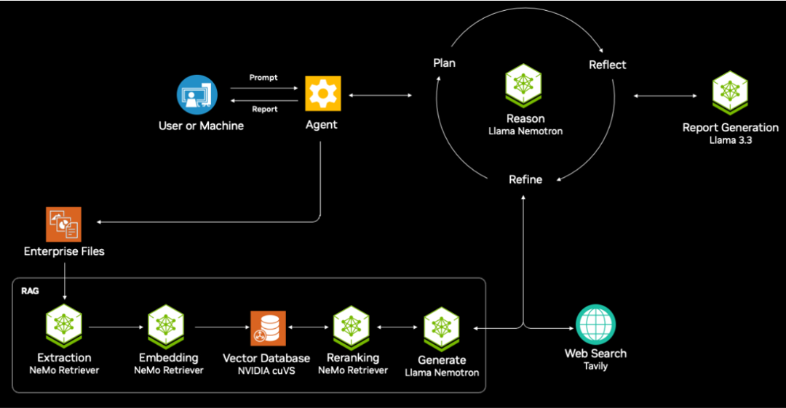
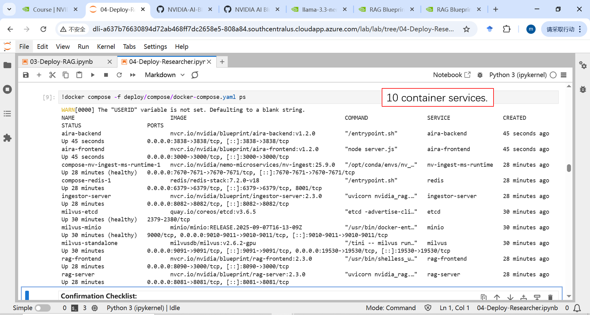
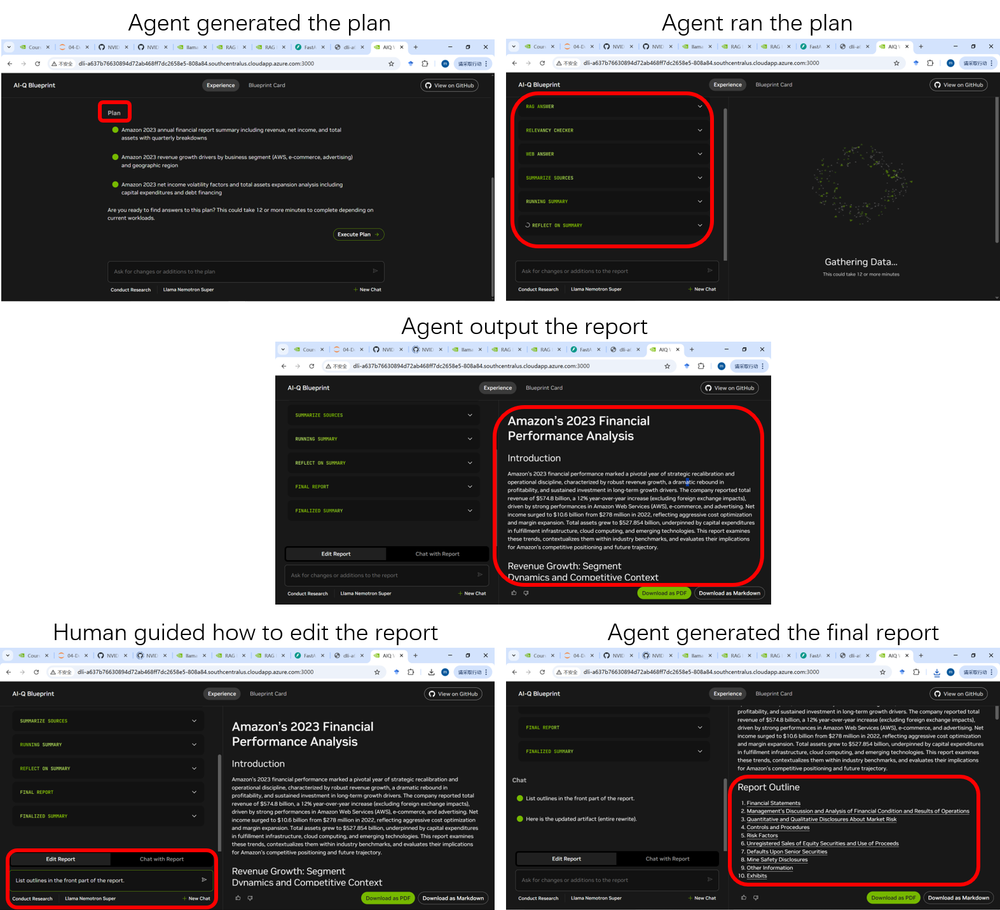

# Learning Notes about NVIDIA's Build a Deep Research Agent Course

Mansen  
2026-01-07

## Purpose of This Article

To document my learning journey through NVIDIA’s Build a Deep Research Agent course, helping interested readers complete the course smoothly, especially by “painlessly” running the code experiments, and to share my personal reflections on the learning process.

## Outline

- Purpose of This Article  
- What Does the Build a Deep Research Agent Course Ultimately Aim to Teach?  
- Introduction to the BDRA Course  
- How to Successfully Complete the BDRA Course (Running the Code Experiments)  
- Personal Learning Reflections  
- Additional Notes  
- Final Remarks

## What Does the Build a Deep Research Agent Course Ultimately Aim to Teach?

The Build a Deep Research Agent course (abbreviated BDRA) teaches how to build, deploy, and run an AI assistant capable of conducting deep research. The final output of this AI assistant is a research report. For example, if I want to conduct financial and economic research and generate a report, I only need to give the AI assistant a specific topic, such as “Amazon’s 2023 Financial Performance Analysis.” It will then break the task down into smaller subtasks, search for relevant materials, generate sections of the report, perform reflection and verification, and even allow me—the human user—to provide guidance and constraints throughout the workflow. Ultimately, it produces a deep, high-quality research report (see Figure 01).

Figure 01. Deep Research Agent App Output Example

To achieve this learning goal, the BDRA course covers foundational knowledge and coding methods step by step, enabling learners to gradually acquire the skills needed to build a Deep Research Agent.

## Introduction to the BDRA Course

Build a Deep Research Agent is a free online course (in English) offered by NVIDIA’s Deep Learning Institute (DLI). The registration URL is as follows (see screenshot in Figure 02):  
[https://learn.nvidia.com/courses/course-detail?course_id=course-v1:DLI+S-FX-40+V1]()

Note: A friend of mine had to use a VPN to see the "Enroll Now" button on the course registration page.

Figure 02. Course Registration and Title Page

Scrolling down the page reveals the course outline (see Figure 03).

Figure 03. Course Outline

In fact, the actual learning interface contains a rich set of materials. Interested readers can refer to the later section “About the Organization of Course Materials.”

In short, the course primarily uses four runnable JupyterLab notebooks to teach learners how to:

- Prepare by obtaining API keys (NGC for calling NVIDIA cloud-based LLMs, Tavily for web search)
- Deploy NVIDIA Inference Microservices (NIM) containers with advanced reasoning capabilities
- Deploy a Retrieval-Augmented Generation (RAG) pipeline for querying private documents
- Deploy an Agent capable of generating deep research reports

## How to Successfully Complete the BDRA Course (Running the Code Experiments)

This section uses the four main notebooks as a guide, explaining key points for smoothly running the code experiments.

### 01-Prerequisites.ipynb

First, if certain web pages do not render properly or buttons are missing, try using a VPN as my friend did. Also, try to watch the introductory video at the start of each notebook—it gives a helpful overview (see Figure 04).

Figure 04. Introductory Video in a Notebook

Also, “NGC” stands for NVIDIA GPU Cloud services. Visit [https://catalog.ngc.nvidia.com](https://catalog.ngc.nvidia.com) to begin working with NVIDIA cloud-based LLMs.

For the 01 notebook, our main task is to obtain the following two API keys:

Table 01. API Keys

| API Key Types | Functions    | Example Key Content (Fake)                                             |
| ------------- | ------------ | ---------------------------------------------------------------------- |
| NVIDIA NGC    | Calling LLMs | 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 |
| Tavily        | Web search   | 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                              |

### 02-Deploy-NIM.ipynb

First, what is NIM? It stands for NVIDIA Inference Microservices. These are containerized microservices that make it easier to perform inference calls on LLMs. NVIDIA Nemotron refers to a series of large models derived from open-source models (e.g., Llama) but optimized by NVIDIA for efficient reasoning tasks and agentic workflows.

Reasoning tokens are a key concept in the 02 notebook. To understand: when calling a Nemotron model (e.g., llama-3_3-nemotron-super-49b-v1_5) for inference, you can pass a reasoning parameter. If `reasoning=True`, the model first generates reasoning text (these are the reasoning tokens) before producing the final answer. If `reasoning=False`, it outputs only the answer. In code, this is controlled by the system content value (`/no_think` or `/think`). Figure 05 shows an example using the question “How many r’s are in the word ‘strawbarry’?” to illustrate the effect of reasoning tokens.

Figure 05. Nemotron LLM Inference Without or With Reasoning Tokens

The 02 notebook experiment is relatively straightforward, but the next two (03 and 04) require more caution. After finishing 02, take a good break. Next time, restart the entire JupyterLab notebook environment (resetting the 4‑hour runtime limit) and proceed to the 03 notebook.

### 03-Deploy-RAG.ipynb

Although this section focuses on the 03 notebook, a heads‑up: if you restart the JupyterLab environment after running 03 and then try to run 04 separately, problems will occur. The 04 notebook depends on the results from 03. A better strategy is to study 03 carefully, using almost the full 4‑hour session, then rest. Next time, restart the environment, quickly rerun 03, and then immediately run 04 (without closing 03).

Now back to the 03 notebook. RAG (Retrieval‑Augmented Generation), simply put, means searching a private document database for the user’s query, retrieving the most relevant document snippets, and feeding both the query and those snippets to an LLM to produce a more relevant and accurate answer.

Actually, RAG components and workflows are quite complex—forgive me for borrowing a complex diagram from the course materials to illustrate this (see Figure 06).

Figure 06. NVIDIA RAG Blueprint

In the 03 notebook, however, the focus is on giving learners hands‑on experience deploying a RAG pipeline—getting through the notebook successfully is the goal.

Regarding the RAG Playground URL:

In section 2.9 “Access the RAG Playground,” learners are guided to open a web interface to experience RAG. The URL is the hostname of the current notebook (see Figure 07) with “:8090” appended.

Figure 07. RAG Playground URL and Interface

Comparison of LLM without RAG and with RAG:

Coincidentally, DeepSeek published a new paper on December 31, 2025, as a New Year’s gift. I used it to test whether RAG can enhance an LLM’s ability to answer questions about recent information.

Figure 08. Experiment Comparing LLM Without RAG and With RAG

In the 03 notebook, it’s best to run code cells manually one by one. Some code involves pulling and starting Docker images, which takes time, and other code is written as asynchronous functions. If you run later cells before the services are stable or async tasks are complete, problems may arise. Pay special attention to places where the notebook explicitly says to wait before proceeding.

### 04-Deploy-Researcher.ipynb

The 04 notebook is the final one in the course. Simply put, the Deep Research Agent’s main goal is to generate high‑quality, reliable research reports (see Figure 01). This Agent builds upon the RAG pipeline from the 03 notebook, adding web search for additional context, and introduces more human‑intervention points and measures in the Agent workflow, making the final report better aligned with individual user expectations. Reminder: run 04 immediately after successfully running 03 to ensure the code experiments work.

The underlying system mechanism of the Deep Research Agent is shown below (Figure 09).

Figure 09. Mechanism of the Deep Research Agent

During deployment, compared to the 8 containers in the 03 notebook’s RAG pipeline, the 04 notebook adds `aira-backend` and `aira-frontend` containers, totaling 10 containerized microservices (see Figure 10).

Figure 10. 10 Container Services for the Deep Research Agent

The final working mode of the Deep Research Agent App is as follows (Figure 11).

Figure 11. Work Mode of the Deep Research Agent App

An example of the Deep Research Agent App running on a financial‑economics topic is shown below (Figure 12).

Figure 12. A Financial Report Generated by the Deep Research Agent

## Personal Learning Reflections

### Re‑ranking Method in the RAG Pipeline

In section 5, “Understanding Document Retrieval and Reranking” of the 03 notebook, the two‑phase retrieval process in RAG is explained in detail (see Figure 13).

Figure 13. Two Phases in RAG Retrieval

I want to highlight that re‑ranking here uses a separate model for ranking, not simply sorting by the earlier semantic similarity score. In my experiment, the Stage 2 ranking swapped the positions of chunk #2 and #3 compared to Stage 1, showing that actual re‑ranking occurred. The benefit is that instead of relying solely on semantic similarity—which can be vague—a more linguistically capable model performs a human‑like selection, often yielding a ranking closer to human expectation. The drawback is the added model processing step, which increases system latency, computational load, and cost.

### Characteristics of the Deep Research Agent

Break‑down is key to the “depth” of the Deep Research Agent. Given a research topic, the Agent can break it into multiple subtasks (see Figures 05 and 12), obtain results for each, and finally synthesize them into a whole. This approach is closely related to “first‑principles” thinking, divide‑and‑conquer, and exhaustive enumeration.

Automation without human intervention vs. human‑in‑the‑loop collaboration. Essentially, the Deep Research Agent leans toward human‑in‑the‑loop collaboration. This suits scenarios like deep investigation, where meeting the specific needs of the current user is important. If you keep clicking “approve/execute,” it can approximate fully automated mode. Other Agent products, such as ByteDance’s AnyGen App, are also moving toward human‑AI collaboration. Clearly, for enterprise‑grade Agent applications, precise human control is a significant requirement.

### The Deep Research Agent Still Cannot Fully Meet Individual Human Expectations

In my 04‑notebook experiment on financial‑economics research (Figure 12), after the Agent generated the first draft, I entered the prompt “List outlines in the front part of the report” to ask the Agent to add an outline. The new version did include a “Report Outline” section. However, when I checked whether the outline items matched the subsequent section headings, I found it difficult to see a clear correspondence—almost as if hallucination had occurred. This likely requires further dialogue with the Agent, describing my needs in more detail, to better achieve the desired outcome. Additionally, I believe the underlying models in this Deep Research Agent system need more post‑training and testing improvements to more intelligently grasp common research requirements.

## Additional Notes

### About the Organization of Course Materials

The high‑level framework of the Build a Deep Research Agent course is shown below (Figure 14).

Figure 14. Course Framework

The primary learning activity takes place in the Interactive Environment, which opens automatically from the course homepage. Learners see an introductory text (Figure 15), an overview video, and then are asked to launch the JupyterLab notebook environment. After about 15 minutes, the JupyterLab interface appears (Figure 15). In the left‑hand file‑tree view, you’ll see five notebooks (00‑04). Each notebook starts with an overview video, followed by the learning and experimental content. After completing the notebooks and successfully running the code, learners can proceed to the “Assessment questions” section (Figure 15) for theory exercises, then to “Feedback” to submit course feedback (Figure 15). After all these steps, the course name appears in the “Completed Courses” section on the “my‑learning” page (Figure 15). At that point, you’re done—congratulations!

Figure 15. Course Material Pages at Different Stages

## Final Remarks

Well, finally, the last section! I started learning the Build a Deep Research Agent course on January 1 (New Year’s Day), documenting the process and writing these notes, and have been busy until January 6. The three‑day New Year holiday felt like no holiday at all—I even had to add three more days just to write this article.

Actually, overall, this course is quite beginner‑friendly. However, it still requires some foundational knowledge. I think it’s best suited for someone at my level. So, what’s my level? I’m the person who won the “Excellence Award” in the NVIDIA Agent Hackathon (China) 2025! Back then, I had zero exposure to NVIDIA Agents—that hackathon gave me hands‑on experience with Agent deployment and sparked my learning about Agents. Studying Build a Deep Research Agent now feels like a follow‑up special topic—focusing on how to use Agents to produce high‑quality research reports. This “mini‑hackathon” style of learning has deepened my understanding of Agents once again. Hope we can all progress together in the NVIDIA community in 2026!
